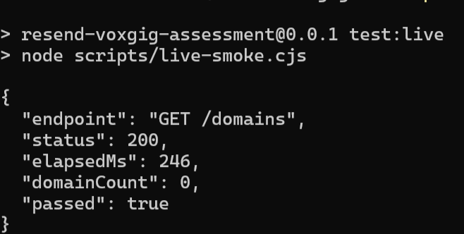

# Resend SDK

TypeScript client generated from Resend's official OpenAPI definition with the Voxgig SDK Generator. Maintained by Hüseyin Tunay Çelik.

This repository contains the generated client, its reproducible model, tests and a short evaluation of the generator. It is unofficial and is not affiliated with Resend.

**Status:** generation and TypeScript compilation are verified. The final offline suite passed 522 tests, failed 0 and skipped 1 on both Ubuntu and Windows CI. A participant-run live smoke test authenticated successfully against Resend; this is not a production-ready release.

## Quickstart

Requires Node.js 24 or newer. Run these commands from the repository root:

```sh
npm ci --prefix ts
npm run build
node scripts/verify-smoke.cjs
```

The final command checks request construction and empty-domain responses offline. It does not contact Resend and needs no credentials.

The equivalent client call in a TypeScript application:

```ts
import { ResendSDK } from './ts/dist/ResendSDK'

const client = new ResendSDK({
  apikey: process.env.RESEND_API_KEY,
  headers: { 'user-agent': 'resend-voxgig-sdk/0.0.1' },
})
const domains = await client.Domain().list()
console.log(domains.length)
```

For a real read-only request, set `RESEND_API_KEY` in your local environment with a key permitted to list domains, then run:

```sh
npm run test:live
```

The live smoke test calls `GET /domains` through the generated client, checks HTTP 200 and the response array, and prints only status, timing and record count. It does not send email. An empty domain list is valid. The script fails if the key is absent; no live pass is claimed until it runs successfully.

### Live verification evidence

The participant-run smoke test authenticated against Resend and completed with HTTP 200. The captured output contains no API key or response payload.



Keep credentials out of source control. `.env.example` documents the variable name; the script reads the environment and does not automatically load `.env` files.

## Using the client

After building, the CommonJS entrypoint is `ts/dist/ResendSDK.js`; TypeScript declarations are generated beside it. Instantiate `ResendSDK` with an `apikey` option. `client.Domain().list()` returns domain entities, while `client.direct({ method: 'GET', path: '/domains' })` returns a response envelope.

See the executable [live example](scripts/live-smoke.cjs), its [offline verification](scripts/verify-smoke.cjs), and the generated [TypeScript reference](ts/REFERENCE.md). The package is not published to npm; install instructions intentionally use this checkout.

## Engineering evidence

Measured on 29 September 2026 with Node 24.12.0 on Windows. Durations are single local observations, not cross-machine benchmarks.

| Measurement | Observed result |
| --- | --- |
| OpenAPI input | 3.1.2; Resend definition version 1.5.1 |
| Input paths / HTTP operations | 72 / 113; excludes inbound webhook definitions |
| Generated entity classes / semantic operations | 64 / 100; semantic operations are not a one-to-one endpoint count |
| Generator pipeline | Passed; 6.7 s on the recorded run |
| Forced TypeScript build | Passed; 4.2 s on the recorded run |
| Final generated test suite | 522 passed, 0 failed, 1 skipped; 523 total; Ubuntu and Windows CI passed |
| Request smoke verification | Passed offline for direct and Domain.list calls |
| Scaffold consistency (`doctor`) | Passed |
| Live API validation | Passed `GET /domains`: HTTP 200, 246 ms, 0 domains |
| Client runtime dependencies | 0 |
| Toolchain dependency audit | 2 moderate affected packages; separate from client runtime |

Generation, compilation and test results measure different things. The metrics regression test remains enabled and now passes. Neither endpoint counts nor offline passes establish full live API coverage. Details and actionable improvement proposals are in the [generator evaluation](reports/DX-REPORT.md).

## Reproduce generation and verification

```sh
npm ci --prefix .sdk
npm run generate
npm ci --prefix ts
npm run build
npm test
npm run doctor
```

`npm test` returns a successful exit status; the single skip covers a feature this SDK does not generate. The root commands use Node argument arrays to avoid Windows shell incompatibilities in the generated target's npm scripts. Generation uses a narrowly scoped Windows filesystem adapter; its cause and limitations are documented in the evaluation.

The source definition is pinned to [Resend commit 83c9782](https://github.com/resend/resend-openapi/tree/83c9782f3e14d5c6e5a89c6eb92f872aa0dad64d). The checked-in dependency lockfiles record the resolved toolchain. No SDK runtime code was hand-written as a substitute for Voxgig generation.

## Repository layout

| Path | Purpose |
| --- | --- |
| `spec/` | Pinned upstream API definition and its license |
| `.sdk/` | Generator model, templates, components and build dependencies |
| `ts/` | Generated TypeScript client and tests |
| `scripts/` | Portable build runner and smoke-test examples |
| `reports/` | Measured execution results and generator evaluation |

Make API-shape changes in the model or guide and regenerate. Avoid editing `ts/` directly. Root documentation is maintained separately from generated target documentation. The root build recompiles all files but does not remove stale output following a model deletion; use a clean checkout for that case.

## License

[MIT](LICENSE). Upstream notices remain applicable to generated and vendored code. The Resend definition retains its [upstream license](spec/LICENSE).

